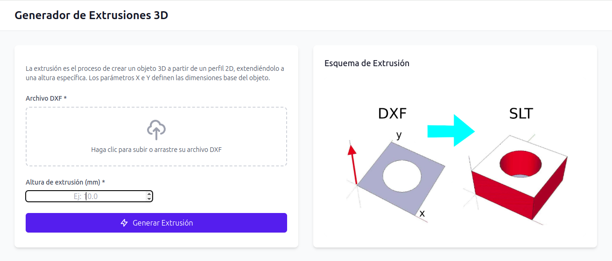

# 3D Model Generator from DXF

Este proyecto permite crear modelos 3D en formato STL a partir de una imagen DXF y una altura de extrusión. 
Está desarrollado en Python y se ejecuta utilizando Docker
Está el proyecto completo por si quieres correrlo un tu equipo, servidor o vps

<div align="center">
  
</div>

## funcionamiento de la aplicacion

- Subir una silueta en formato DXF.
- colocar la altura de extrusion del objeto.
- Ejecución sencilla utilizando Docker y Docker Compose.


## Instalación

1. **Ejecuta directamente con docker:**

ejecución directa, ejecuta el comando de docker


```
docker run -p 5000:5000 manologcode/freecadscripts

```
Abre el navegador y esta corriendo en http://localhost:5000/

2. **Clonar el repositorio:**

puedes clonarte el repositorio, y modificarlo 

para correrlo en modo desarrollo usa:

```bash
docker-compose up --build
```

Licencia
Este proyecto está licenciado bajo la Licencia MIT.

